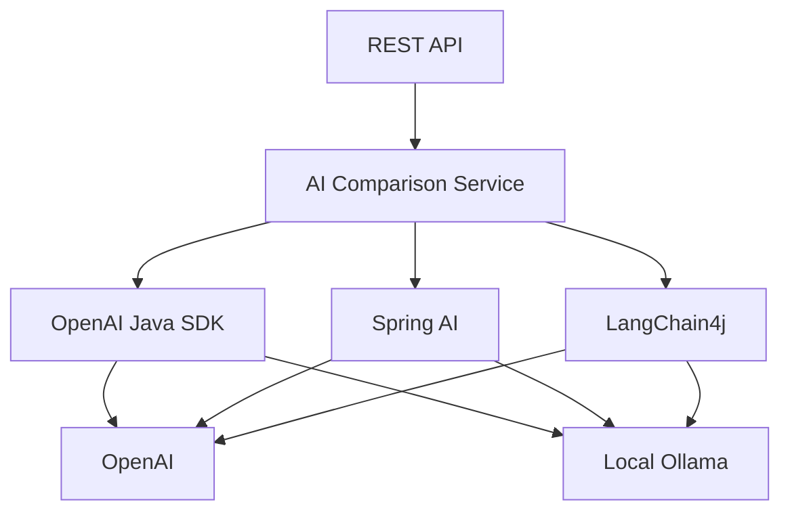

# Java AI Integration Comparison

A Spring Boot application demonstrating how Java developers can connect to hosted and local AI models using three different integration approaches:

- Official OpenAI Java SDK
- Spring AI
- LangChain4j

Each integration connects to:

- OpenAI
- Local Ollama running `qwen3:8b`

The project provides APIs for comparing all six combinations or invoking one selected integration.

## Architecture



Every integration implements the same internal `AiChatAdapter` contract. This allows the service layer to invoke each integration consistently.

## Supported combinations

| Integration | OpenAI | Ollama |
|---|---:|---:|
| Official OpenAI Java SDK | Yes | Yes, through Ollama’s OpenAI-compatible API |
| Spring AI | Yes | Yes |
| LangChain4j | Yes | Yes |

## Technology stack

- Java 25
- Spring Boot 4.1.1
- Official OpenAI Java SDK 4.69.0
- Spring AI 2.0.1
- LangChain4j 1.20.0
- Springdoc OpenAPI 3.1.1
- Maven 3.9+
- Ollama
- Qwen3 8B

## Prerequisites

Install and verify the required tools:

```bash
java -version
mvn -version
ollama --version
```

The project requires Java 25. Configure IntelliJ IDEA, Maven and the project SDK to use JDK 25.

Verify that Maven is using the correct JDK:

```bash
mvn -version
```

The output should include:

```text
Java version: 25
```

## Local Ollama setup

Verify that Ollama is running:

```bash
curl http://localhost:11434/api/tags
```

Pull the local model if it is not already installed:

```bash
ollama pull qwen3:8b
```

List the installed models:

```bash
ollama list
```

The expected model is:

```text
qwen3:8b
```

## OpenAI configuration

Create an API key through the OpenAI API platform.

Never store a real API key in:

- Java source code
- `application.yml`
- `.env.example`
- Git history
- Documentation

Enter the API key without storing it in shell history:

```bash
read -s -p "OpenAI API key: " OPENAI_API_KEY
echo
export OPENAI_API_KEY
```

Configure the OpenAI model:

```bash
export OPENAI_MODEL="gpt-6-luna"
```

Confirm that the API key is configured without displaying it:

```bash
test -n "$OPENAI_API_KEY" \
  && echo "API key configured" \
  || echo "API key missing"
```

## Environment variables

| Variable | Default | Purpose |
|---|---|---|
| `OPENAI_API_KEY` | `not-configured` | OpenAI API project key |
| `OPENAI_BASE_URL` | `https://api.openai.com/v1` | OpenAI API base URL |
| `OPENAI_MODEL` | `gpt-6-luna` | OpenAI model |
| `OLLAMA_BASE_URL` | `http://localhost:11434` | Native Ollama URL |
| `OLLAMA_OPENAI_BASE_URL` | `http://localhost:11434/v1` | Ollama OpenAI-compatible URL |
| `OLLAMA_MODEL` | `qwen3:8b` | Local Ollama model |
| `OLLAMA_API_KEY` | `ollama` | Placeholder key used by the OpenAI-compatible client |

The local Ollama server does not require the placeholder API key by default.

## Build

Compile the project:

```bash
mvn clean compile
```

Run the complete Maven verification lifecycle:

```bash
mvn clean verify
```

## Run

Start the application from the terminal where the OpenAI environment variables were exported:

```bash
mvn spring-boot:run
```

The application starts at:

```text
http://localhost:8080
```

Opening the root URL may return `404 Not Found`. This is expected because the project exposes REST APIs rather than a web page at `/`.

## API documentation

Swagger UI:

```text
http://localhost:8080/swagger-ui.html
```

OpenAPI JSON:

```text
http://localhost:8080/v3/api-docs
```

OpenAPI YAML:

```text
http://localhost:8080/v3/api-docs.yaml
```

## API 1: Compare all integrations

The comparison API sends the same prompt through all six integration and provider combinations.

```http
POST /api/v1/ai/compare
Content-Type: application/json
```

### Request

```json
{
  "prompt": "Explain Java virtual threads in two sentences"
}
```

### cURL example

```bash
curl -s -X POST http://localhost:8080/api/v1/ai/compare \
  -H "Content-Type: application/json" \
  -d '{
    "prompt": "Explain Java virtual threads in two sentences"
  }' | jq
```

### Executed combinations

```text
openai-sdk-openai:gpt-6-luna
openai-sdk-ollama:qwen3:8b
spring-ai-openai:gpt-6-luna
spring-ai-ollama:qwen3:8b
langchain4j-openai:gpt-6-luna
langchain4j-ollama:qwen3:8b
```

### Example result entry

```json
{
  "spring-ai-ollama:qwen3:8b": {
    "integration": "spring-ai",
    "provider": "ollama",
    "model": "qwen3:8b",
    "message": "Virtual threads are lightweight threads managed by the JVM.",
    "durationMs": 1420,
    "status": "SUCCESS",
    "error": null
  }
}
```

Each integration call is isolated. If one call fails, its entry reports the failure while the other results are still returned.

### Parallel execution

The comparison API executes all six calls concurrently using:

- Java virtual threads
- `CompletableFuture`
- A Spring-managed executor

The overall response time should be close to the slowest individual call rather than the sum of all six calls.

The three Ollama requests share the same local GPU. Their individual durations can therefore be affected by resource contention and should not be treated as isolated performance benchmarks.

## API 2: Invoke one integration

The targeted chat API invokes only the selected integration and provider.

```http
POST /api/v1/ai/chat
Content-Type: application/json
```

### Request

```json
{
  "prompt": "Explain Java virtual threads in two sentences",
  "integration": "spring-ai",
  "provider": "ollama"
}
```

### cURL example

```bash
curl -s -X POST http://localhost:8080/api/v1/ai/chat \
  -H "Content-Type: application/json" \
  -d '{
    "prompt": "Explain Java virtual threads in two sentences",
    "integration": "spring-ai",
    "provider": "ollama"
  }' | jq
```

### Example response

```json
{
  "integration": "spring-ai",
  "provider": "ollama",
  "model": "qwen3:8b",
  "message": "Virtual threads are lightweight threads managed by the JVM.",
  "durationMs": 1210,
  "status": "SUCCESS",
  "error": null
}
```

### Valid integration values

```text
openai-sdk
spring-ai
langchain4j
```

### Valid provider values

```text
openai
ollama
```

The model is selected through application configuration and cannot be supplied directly by the API caller.

## Integration details

### Official OpenAI Java SDK

The official SDK uses `OpenAIClient` for both OpenAI and Ollama.

```text
OpenAIClient
├── https://api.openai.com/v1
└── http://localhost:11434/v1
```

The Ollama integration works because Ollama exposes an OpenAI-compatible chat-completions endpoint.

### Spring AI

Spring AI uses:

- `OpenAiChatModel` for OpenAI
- `OllamaChatModel` for Ollama
- `ChatClient` as the application-facing fluent API

### LangChain4j

LangChain4j uses:

- `OpenAiChatModel` for OpenAI
- `OllamaChatModel` for Ollama
- `ChatModel` as the common model abstraction

## Internal adapter contract

All six integrations implement the same interface:

```java
public interface AiChatAdapter {

    IntegrationType integration();

    ProviderType provider();

    String model();

    String chat(String prompt);
}
```

Spring injects every registered adapter into the service:

```java
public ComparisonService(
        List<AiChatAdapter> adapters,
        Executor executor
) {
    this.adapters = List.copyOf(adapters);
    this.executor = executor;
}
```

This makes the design extensible. Another integration or provider can be added by registering another `AiChatAdapter`.

## Package structure

```text
src/main/java/com/gauravthakur/ai/comparison
├── adapter
│   ├── openaisdk
│   ├── springai
│   └── langchain4j
├── config
├── controller
├── dto
├── model
├── service
└── JavaAiComparisonApplication.java
```

## Error handling behavior

For the comparison API:

- Each adapter failure is captured independently.
- Other adapters continue executing.
- Failed entries contain `status: "FAILED"`.
- The corresponding error is included in the entry.

Example:

```json
{
  "openai-sdk-openai:gpt-6-luna": {
    "integration": "openai-sdk",
    "provider": "openai",
    "model": "gpt-6-luna",
    "message": null,
    "durationMs": 215,
    "status": "FAILED",
    "error": "Authentication failed"
  }
}
```

## Security considerations

- Never commit `OPENAI_API_KEY`.
- Never print API keys in application logs.
- Do not log authorization headers.
- Review OpenAI usage and spending limits.
- Do not expose this demonstration publicly without authentication and rate limiting.
- Keep `.env` and local secret files excluded through `.gitignore`.

## Current scope

This project demonstrates:

- OpenAI and local-model connectivity
- Multiple Java AI integration libraries
- Adapter-based application design
- Spring dependency injection
- Provider and integration routing
- Parallel calls using virtual threads
- Failure isolation
- Externalized configuration
- Swagger/OpenAPI documentation

This repository is an integration demonstration. It is not intended to provide formal model-quality, throughput or latency benchmarking.